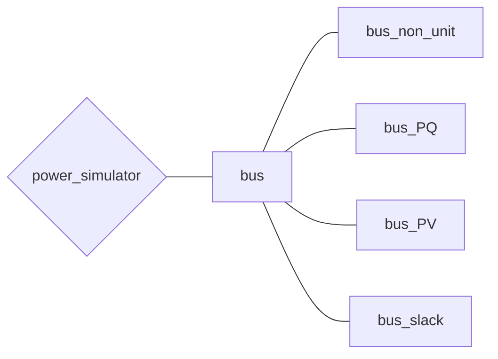

# バスについて

## 電力系統モデルについて取り扱っているチュートリアル
- [電力ネットワークの構成について](../../abstract)
- [「教科書に沿って学ぶ」ベース(withText)](../../Tutorials/withText)
- [解析する電力ネットワークを作成する(make_net)](../../Tutorials/make_net)
- [【第四回】電力系統の自作](../../Tutorials/step4)

## *bus* クラスの全体像

まずはバスに関するクラスの全体像を示します。

## **bus**
([bus.m]()) 

全てのBusクラスの基底クラス．

### メンバ変数
- component：繋がれた機器のインスタンス
- x：繋がれた機器の内部状態
- V：バスの電圧（複素数値）
- shunt：バスと地面とのシャント抵抗のインピーダンス（複素数値）

### メンバ関数
- **`add_component(obj, component)`**  
    バスに機器を繋ぐための関数
    - 入力変数 `component`  
        バスに繋ぐ機器のインスタンス  
        例えば、load, controller, generator など

## **bus_non_unit**
([bus_non_unit.m]()) 

non-unit Busの実装（ ***bus*** クラスの派生クラス）

### メンバ関数
- **`obj = bus_non_unit(shunt)`**  
    - 入力引数 `shunt`：シャント抵抗値（複素数値）

## **bus_PQ**
([bus_PQ.m]()) 

PQ Busの実装（ ***bus*** クラスの派生クラス）

### メンバ変数
- P：バスの有効電力
- Q：バスの無効電力

### メンバ関数
- **`obj = bus_PQ(P, Q, shunt)`**  
    有効電力と無効電力を指定するバス、主に負荷の接続されるバスに利用
    - 入力引数 `P`：有効電力の指定
    - 入力引数 `Q`：無効電力の指定
    - 入力引数 `shunt`：シャント抵抗値（複素数値）

## **bus_PV**
([bus_PV.m]()) 

PV Busの実装（ ***bus*** クラスの派生クラス）

### メンバ変数
- Vabs：バスの電圧の絶対値
- P：バスの有効電力

### メンバ関数
- **`obj = bus_PQ(V, P, shunt)`**  
    電圧の絶対値と有効電力を指定するバス、主に発電機の接続されるバスに利用  
    - 入力引数 `V`：電圧の絶対値の指定
    - 入力引数 `P`：有効電力の指定
    - 入力引数 `shunt`：シャント抵抗値（複素数値）

## **bus_slack** ([bus_slack.m]()) 

slack (swing) Busの実装（ ***bus*** クラスの派生クラス）

### メンバ変数
- Vabs：バスの電圧の絶対値
- Vangle：バスの電圧の位相角

### メンバ関数
- **`obj = bus_slack(Vabs, Vangle, shunt)`**  
    電圧の絶対値と位相角を指定するバス、主に発電機の接続されるバスに利用（ネットワークのうちで一つの発電機がslackバスに接続されていなければならない）
    - 入力引数 `Vabs`：電圧の絶対値の指定
    - 入力引数 `Vangle`：電圧の位相角の指定
    - 入力引数 `shunt`：シャント抵抗値（複素数値）
