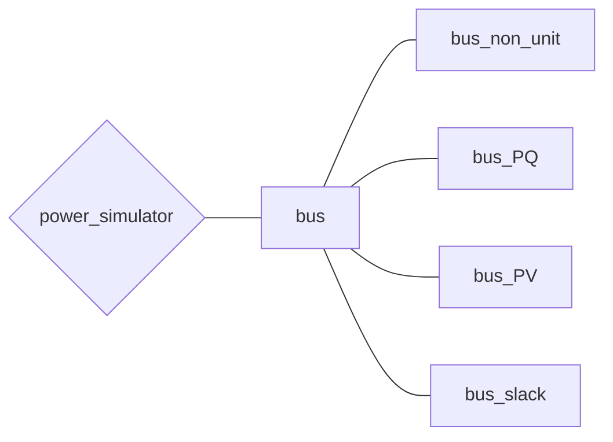

# （準備中）バスについて

## クラスの全体像(再掲)

まずはバスに関するクラスの全体像を示します。

## bus

[bus.m]()

全てのBusクラスの基底クラス．  

## bus_non_unit

[bus_non_unit.m]()

non-unit Busの実装．  

## bus_PQ

[bus_PQ.m]()

PQ Busの実装．  

## bus_PV

[bus_PV.m]()

PV Busの実装．  

## bus_slack

[bus_slack.m]()

slack (swing) Busの実装．  
