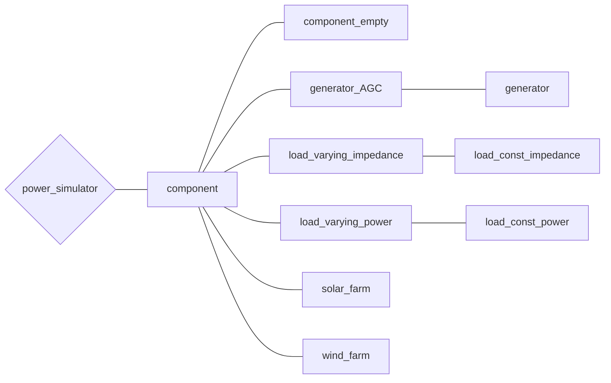

# （準備中）バスに接続する機器について

## バスに接続する機器について取り扱っているチュートリアル
- [電力ネットワークの構成について](/Docs/abstract)
- [「教科書に沿って学ぶ」ベース(withText)](/Docs/Tutorials/withText)
- [解析する電力ネットワークを作成する(make_net)](/Docs/Tutorials/make_net)
- [【第四回】電力系統の自作](/Docs/Tutorials/step4)
- [【第五回】機器の自作](/Docs/Tutorials/step5)

## *component* クラスの全体像

まずは機器に関するクラスの全体像を示します。

## component
([component.m]()) 

全てのComponentクラスの基底クラス．  

## component_empty
([component_empty.m]()) 

## generator_AGC
([generator_AGC.m]()) 

## generator
 ([generator.m]()) 

## load_varying_impedance
([load_varying_impedance.m]()) 

## load_const_impedance
([load_const_impedance.m]()) 

## load_varying_power
([load_varying_power.m]()) 

## load_const_power
([load_const_power.m]()) 

## solar_farm
([solar_farm.m]()) 

風力発電機の実装（ ***component*** クラスの派生クラス）  
(ひとまず削除)

## wind_farm
([wind_farm.m]()) 

風力発電機の実装（ ***component*** クラスの派生クラス）  
(ひとまず削除)
