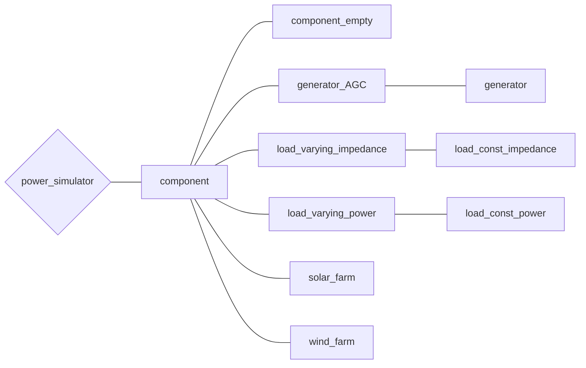

# バスに接続する機器について

## バスに接続する機器について取り扱っているチュートリアル
- [電力ネットワークの構成について](../../abstract)
- [「教科書に沿って学ぶ」ベース(withText)](../../Tutorials/withText)
- [解析する電力ネットワークを作成する(make_net)](../../Tutorials/make_net)
- [【第四回】電力系統の自作](../../Tutorials/step4)
- [【第五回】機器の自作](../../Tutorials/step5)

## *component* クラスの全体像

まずは機器に関するクラスの全体像を示します。

## component
([component.m]()) 

全てのComponentクラスの基底クラス．  
(メンバ変数について説明する必要があるか疑問)

### 抽象メソッド
- **`x = initialize(varargin)`**  
    入力引数は任意に指定できるが，基本的には以下の3種である  
    - 入力変数 `V`：電圧の平衡点（複素数値）
    - 入力変数 `I`：電流の平衡点（複素数値）
    - 入力変数 `net`：機器を追加する予定のネットワークのインスタンス（ *power_network* クラス）
- **`nx = get_nx(varargin)`**  
    接続する機器の状態の次元を取得するためのメソッド  
    - 出力変数 `nx`：状態の次元
- **`nu = get_nu(varargin)`**
    接続する機器への入力の次元を取得するためのメソッド  
    - 出力変数 `nu`：
- **`[dx, I] = get_dx_I(t, x, V, u);`**  
    機器の状態の微分と出力電流を取得するためのメソッド  
    - 入力変数 `t`：時刻
    - 入力変数 `x`：機器の状態（ベクトル）
    - 入力変数 `V`：各バスの電圧（2*bus数 の行列）
    - 入力変数 `u`：機器への入力信号（ベクトル）
    - 出力変数 `dx`：機器の状態の微分（ベクトル）
    - 出力変数 `I`：機器の出力電流（ベクトル）

### メソッド
- **`[A, B, C, D, BV, DV, R, S] = get_linear_matrix(obj)`**  
    以下の式のような線形化したシステムの行列A，B，C，D，BV，DVを返すメソッド。

    $$
    \begin{matrix}
    \begin{align}
  　\dot{x}　&=A(x-x^*)+Bu+B_V(V-V^*)＋Rd\\
    I-I^*&=C(x-x^*)+Du+D_V(V-V^*)\\
    ｚ&＝S(x^*-x)
    \end{align}
    \end{matrix}
    $$
  ただしR,Sは制御系設計のために使われる外乱ポートと評価出力ポートであり機器の性質ではないため消しても構わない。  
  
- **`[dx, I] =get_dx_I_linear(obj, t, x, v, u)**`  
    上のメソッド**`get_dx_I`**の線形化バージョンである  
    現状、get_linear_matrixを実装しても自動的に反映されない  
    入出力変数は上のメソッドと同じ  
    - `get_dx_I_linear`と`get_linear_matrix`を実装しない場合、initializeの中で  
        `obj.numerical_diff(x, [Vr; Vi]);`
    を呼ぶと、平衡点周りでの数値積分によって２つのメソッドがつかえるようになる。  

## component_empty
([component_empty.m]()) 

空の機器の実装（ ***component*** クラスの派生クラス）

## generator_AGC
([generator_AGC.m]()) 

発電機の実装（ ***component*** クラスの派生クラス）
AVRポートとAGCポートの二種類のポートがある．
(メンバ変数について説明する必要があるか疑問)  

### コンストラクタ
**`obj = generator_AGC(mac, exc, pss)`**

- 入力変数 `mac`  
    発電機のパラメータ（構造体）  
    - `Xd, Xq`：（それぞれ d, q 軸周りの）同期リアクタンス
    - `Xdp`：（d軸周りの）過渡リアクタンス
    - `Tdo`：d軸周りの回路時定数
    - `M`：慣性定数
    - `d`：制動係数
- 入力変数 `exc`
    AVRのパラメータ（構造体）  
    - `Ka`：AVRゲイン
    - `Te`：励磁機時定数
- 入力変数 `pss`  
    PSSのパラメータ（構造体）  
    - `Kpss`：PSSゲイン
    - `Tpss`：washoutフィルターの時定数
    - `TL1p, TL1`：第一ステージの位相進み遅れ時定数
    - `TL2p, TL2`：第一ステージの位相進み遅れ時定数

## generator
 ([generator.m]()) 

発電機の実装（ ***generator*** クラスの派生クラス）  
[generator_AGC](../component/#generator_agc) との違いは発電機にAGCポートを用意しているかどうか（*genator* クラスはAGCポートを用意していない）

## load_varying_impedance
([load_varying_impedance.m]()) 

定インピーダンス負荷の実装（ ***component*** クラスの派生クラス）
ただし，入力ポートが存在し，インピーダンス値を変化させることが可能．

### メソッド
**`x = initialize(obj, V, I, varargin)`**

平衡点電圧・電流からインピーダンス値を決定し，初期化を行う

## load_const_impedance
([load_const_impedance.m]()) 

定インピーダンス負荷の実装（ ***load_varying_impedance*** クラスの派生クラス）
[load_varying_impedance](../component/#load_varying_impedance) との違いは入力ポートを用意しているかどうか（*load_const_impedance* クラスは入力ポートを用意していないので静的な機器）

## load_varying_power
([load_varying_power.m]()) 

定電力負荷の実装（ ***component*** クラスの派生クラス）
ただし，入力ポートが存在し，インピーダンス値を変化させることが可能．

### メソッド
**`x = initialize(obj, V, I, varargin)`**

平衡点電圧・電流から電力値を決定し，初期化を行う

## load_const_power
([load_const_power.m]()) 

定電力負荷の実装（ ***load_varying_power*** クラスの派生クラス）
[load_varying_power](../component/#load_varying_power) との違いは入力ポートを用意しているかどうか（*load_const_power* クラスは入力ポートを用意していないので静的な機器）

## solar_farm
([solar_farm.m]()) 

風力発電機の実装（ ***component*** クラスの派生クラス）  
(ひとまず削除)

## wind_farm
([wind_farm.m]()) 

風力発電機の実装（ ***component*** クラスの派生クラス）  
(ひとまず削除)
