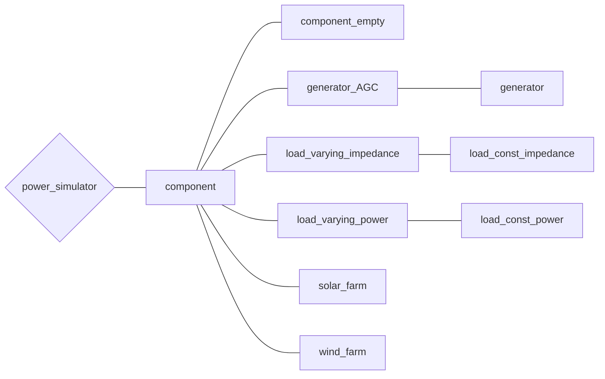

# （準備中）バスに接続する機器について

## クラスの全体像(再掲)

まずは機器に関するクラスの全体像を示します。

## component

[component.m]()

全てのComponentクラスの基底クラス．  

## component_empty

[component_empty.m]()

## generator_AGC

[gennerator_AGC.m]()

### generator

[generator.m]()

## load_varying_impedance

[load_varying_impedance.m]()

### load_const_impedance

[load_const_impedance.m]()

## load_varying_power

[load_varying_power.m]()

### load_const_power

[load_const_power.m]()

## solar_farm

[solar_farm.m]()

## wind_farm

[wind_farm.m]()

