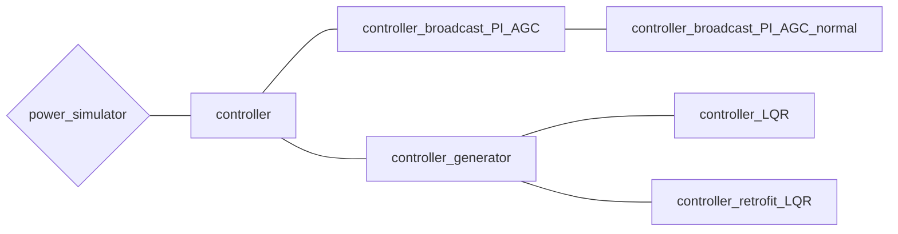

# コントローラについて

## コントローラについて取り扱っているチュートリアル
- [「教科書に沿って学ぶ」ベース(withText)](../../Tutorials/withText)
- [解析する電力ネットワークを作成する(make_net)](../../Tutorials/make_net)
- [【第三回】制御器の導入](../../Tutorials/step3)
- [【第六回】制御器の自作](../../Tutorials/step6)

## *controller* クラスの全体像

まずはコントローラに関するクラスの全体像を示します。

## **controller**
([controller.m]()) 

全てのコントローラクラスの基底クラス．

### 抽象変数
- idx_input：コントローラの出力信号，システムへの入力信号が印加されるバスの番号（ベクトル）
- idx_observe：コントローラが観測できるバスの番号（ベクトル）
- idx：idx_inputとidx_observeを並べたベクトル

### メンバ変数
- get_dx_u_func
    - 無名関数（各インスタンスでget_dx_uなどを指定する）
    - (説明不要かも)

### 抽象メソッド
- **`[dx, u] = get_dx_u(obj, t, x, X, V, I, U_global)`**  
    コントローラの状態の微分と出力信号（システムへの入力信号）を取得するためのメソッド  
    ***controller*** クラスの派生クラスにて実装する  
    - 入力変数 `t`：時刻
    - 入力引数 `x`：コントローラのの状態（ベクトル）
    - 入力引数 `X`：各バスに接続された機器の状態（セル配列）
    - 入力引数 `V`：各バスの電圧（2*bus数 の行列）
    - 入力引数 `I`：各バスの電流（2*bus数 の行列）
    - 入力引数 `U_global`：  
        グローバルコントローラによって各バスに印加される入力信号（セル配列）  
        `add_controller_grobal`で追加されるコントローラ（グローバルコントローラ）では空配列．
    - 出力引数 `dx`：コントローラの状態の微分（ベクトル）
    - 出力引数`u`：コントローラの出力信号，システムへの入力信号（ベクトル）
- **`nx = get_nx(obj)`**
    コントローラの状態変数の次元を取得するためのメソッド  
    ***controller*** クラスの派生クラスにて実装する  
    - 出力引数`nx`：コントローラの状態変数の次元

### メソッド
- `[A, BeX, BeV, Bu, C, DeX, DeV, Du] = get_linear_matrix(obj)`  
    線形化したコントローラを取得するためのメソッドで
    $$
    \dot{x}=Ax+B_X (X-X*)+B_V (V-V*)+B_u U_{global}\\
    u=Cx+D_X (X-X*)+D_V (V-V*)+D_u U_{global}
    $$
    を満たす行列を返す  
    - A：コントローラのA行列
    - BeX：コントローラのB行列（観測するバスの状態をスタックしたベクトルに関する）
    - BeV：コントローラのB行列（全てのバスの電圧をスタックしたベクトルに関する）
    - Bu：コントローラのB行列（グローバルコントローラが生成する全てのバスへの入力信号をスタックしたベクトルに関する）
    - C：コントローラのC行列
    - DeX：コントローラのD行列（観測するバスの状態ベクトルに関する）
    - DeV：コントローラのD行列（全てのバスの電圧をスタックしたベクトルに関する）
    - Du：コントローラのD行列（グローバルコントローラが生成する全てのバスへの入力信号をスタックしたベクトルに関する）

- `[dx, u] = get_dx_u_linear(obj, t, x, X, V, U_global)`  
    線形化したコントローラの状態変数の微分と入力を取得するための関数．  
    - 入力変数 `t`：時刻
    - 入力引数 `x`：コントローラのの状態（ベクトル）
    - 入力引数 `X`：各バスに接続された機器の状態（セル配列）
    - 入力引数 `V`：各バスの電圧（2*bus数 の行列）
    - 入力引数 `I`：各バスの電流（2*bus数 の行列）
    - 入力引数 `U_global`：  
        グローバルコントローラによって各バスに印加される入力信号（セル配列）  
        `add_controller_grobal`で追加されるコントローラ（グローバルコントローラ）では空配列．
    - 出力引数 `dx`：コントローラの状態の微分（ベクトル）
    - 出力引数`u`：コントローラの出力信号，システムへの入力信号（ベクトル）

## **controller_broadcast_PI_AGC**
([controller_broadcast_PI_AGC.m]()) 

ブロードキャストコントローラ（PIコントローラ）の実装（ ***controller*** クラスの派生クラス）  
発電機として[generator_AGC](../component/#generator_agc)を想定している．  

### メンバ変数

- idx_observe：コントローラが観測できるバスの番号（ベクトル）
- idx_input：コントローラの出力信号，システムへの入力信号が印加されるバスの番号（ベクトル）
- net：コントローラを追加する予定のネットワークのインスタンス（ *power_network* クラス）
- Kp：PIコントローラのPゲイン
- Ki：PIコントローラのPゲイン
- K_broadcast：各発電機に対する比例ゲイン（全て1）

### コンストラクタ
**`obj = controller_broadcast_PI_AGC(net, y_idx, u_idx, Kp, Ki)`**

- 入力引数`net`  
    コントローラを追加する予定のネットワークのインスタンス（ *power_network* クラス）  
    詳細は[Step1](../../Tutorials/step1/)・[Power Network](../power_network/)を参照のこと．
- 入力引数`y_idx`  
    出力を観測するバスの番号．
- 入力引数`u_idx`  
    入力を印加するバスの番号．
- 入力引数`Kp` `Ki`  
    コントローラのPIゲイン．

## **controller_broadcast_PI_AGC_normal**
([controller_broadcast_PI_AGC_normal.m]()) 

ブロードキャストコントローラ（PIコントローラ）の実装（ ***controller_broadcast_PI_AGC*** クラスの派生クラス）  
発電機として[generator_AGC](../component/#generator_agc)を想定している．  
[controller_broadcast_PI_AGC](../controller/#controller_broadcast_pi_agc)との違いは，ゲインを電力に比例した形，すなわち，generatorの規模に比例して調整電力を分配していること（[controller_broadcast_PI_AGC](../controller/#controller_broadcast_pi_agc)では全て等しいゲインとしている）  

### メンバ変数

- idx_observe：コントローラが観測できるバスの番号（ベクトル）
- idx_input：コントローラの出力信号，システムへの入力信号が印加されるバスの番号（ベクトル）
- net：コントローラを追加する予定のネットワークのインスタンス（ *power_network* クラス）
- Kp：PIコントローラのPゲイン
- Ki：PIコントローラのPゲイン
- K_broadcast：各発電機に対する比例ゲイン（平均すると1）

### コンストラクタ
**`obj = controller_broadcast_PI_AGC_normal(net, y_idx, u_idx, Kp, Ki)`**

- 入力引数`net`  
    コントローラを追加する予定のネットワークのインスタンス（ *power_network* クラス）  
    詳細は[Step1](../../Tutorials/step1/)・[Power Network](../power_network/)を参照のこと．
- 入力引数`y_idx`  
    出力を観測するバスの番号．
- 入力引数`u_idx`  
    入力を印加するバスの番号．
- 入力引数`Kp` `Ki`  
    コントローラのPIゲイン．

## **controller_generator**
([controller_generator.m]()) 

ブロードキャストコントローラを除く全てのコントローラクラスの基底クラス（ ***controller*** クラスの派生クラス）  
(メンバ変数について説明する必要があるか疑問)  

### コンストラクタ
**`obj = controller_generator(net, area, model, bus_model, X, V, I, U, AVRonly, varargin)`**

- 入力引数 `net`  
    コントローラを追加する予定のネットワークのインスタンス（ *power_network* クラス）  
    詳細は[Step1](../../Tutorials/step1/)・[Power Network](../power_network/)を参照のこと．
- 入力引数 `area`  
    コントローラを追加するバスの番号（ベクトル）  
    指定したバスに入力を印加し，出力を観測できる．
- 入力引数 `model`  
    環境の状態空間モデル（matlab既存の ***ss*** クラスのインスタンス）  
    環境とは全体ネットワークから`area`で指定しているバスを除くシステム全体（または一部）のモデルのこと．
- 入力引数 `bus_model`  
    環境のモデルが接続しているバスの番号（ベクトル）  
    すなわち，制御器設計を行うローカルシステムと環境が相互接続しているバスを指定する．  
    規定値：`area`で指定されているバスの中で`area`外のバスと接続されているもの．
- 入力引数 `X`  
    発電機の状態の平衡点（規定値：導入するネットワークにおける平衡点）
- 入力引数 `V`  
    電圧の平衡点（規定値：導入するネットワークにおける平衡点）
- 入力引数 `I`  
    電流の平衡点（規定値：導入するネットワークにおける平衡点）
- 入力引数 `U`  
    入力の平衡点（規定値：導入するネットワークにおける平衡点）
- 入力引数 `AVRonly`  
    `area`で指定したバスに接続している機器の中でgenerator_AGCを含むかどうか．含む場合は**true**，含まない場合は**false**（規定値：true）

## **controller_LQR**
([controller_LQR.m]()) 

あるバスに対するLQRの実装（ ***controller_generator*** クラスの派生クラス）  
rectifierの有無を比較するために使用した．

### コンストラクタ
**`obj = controller_LQR(net, area, Q, R, model, bound, varargin)`**

- 入力引数 `net`  
    コントローラを追加する予定のネットワークのインスタンス（ *power_network* クラス）  
    詳細は[Step1](../../Tutorials/step1/)・[Power Network](../power_network/)を参照のこと．
- 入力引数 `area`  
    コントローラを追加するバスの番号（ベクトル）  
    指定したバスに入力を印加し，出力を観測できる．
- 入力引数 `Q`：LQRのQゲイン（行列）
- 入力引数 `R`：LQRのRゲイン（行列）
- 入力引数 `model`
    環境の状態空間モデル（matlab既存の ***ss*** クラスのインスタンス）  
    環境とは全体ネットワークから`area`で指定しているバスを除くシステム全体（または一部）のモデルのこと．
- 入力引数 `bound`
    環境のモデルが接続しているバスの番号（ベクトル）  
    すなわち，制御器設計を行うローカルシステムと環境が相互接続しているバスを指定する．  
    規定値：`area`で指定されているバスの中で`area`外のバスと接続されているもの．

## **controller_retrofit_LQR**
([controller_retrofit_LQR.m]()) 

レトロフィットコントローラの実装で，コントローラ設計をLQRで行うもの（ ***controller_genarator*** クラスの派生クラス）

### コンストラクタ
**`obj = controller_retrofit_LQR(net, area, Q, R, model, bound, X, V, I, U, varargin)`**

- 入力引数 `net`  
    コントローラを追加する予定のネットワークのインスタンス（ *power_network* クラス）  
    詳細は[Step1](../../Tutorials/step1/)・[Power Network](../power_network/)を参照のこと．
- 入力引数 `area`  
    コントローラを追加するバスの番号（ベクトル）  
    指定したバスに入力を印加し，出力を観測できる．
- 入力引数 `Q`：LQRのQゲイン（行列）
- 入力引数 `R`：LQRのRゲイン（行列）
- 入力引数 `model`
    環境の状態空間モデル（matlab既存の ***ss*** クラスのインスタンス）  
    環境とは全体ネットワークから`area`で指定しているバスを除くシステム全体（または一部）のモデルのこと．
- 入力引数 `bound`
    環境のモデルが接続しているバスの番号（ベクトル）  
    すなわち，制御器設計を行うローカルシステムと環境が相互接続しているバスを指定する．  
    規定値：`area`で指定されているバスの中で`area`外のバスと接続されているもの．
- 入力引数 `X`  
    発電機の状態の平衡点（規定値：導入するネットワークにおける平衡点）
- 入力引数 `V`  
    電圧の平衡点（規定値：導入するネットワークにおける平衡点）
- 入力引数 `I`  
    電流の平衡点（規定値：導入するネットワークにおける平衡点）
- 入力引数 `U`  
    入力の平衡点（規定値：導入するネットワークにおける平衡点）