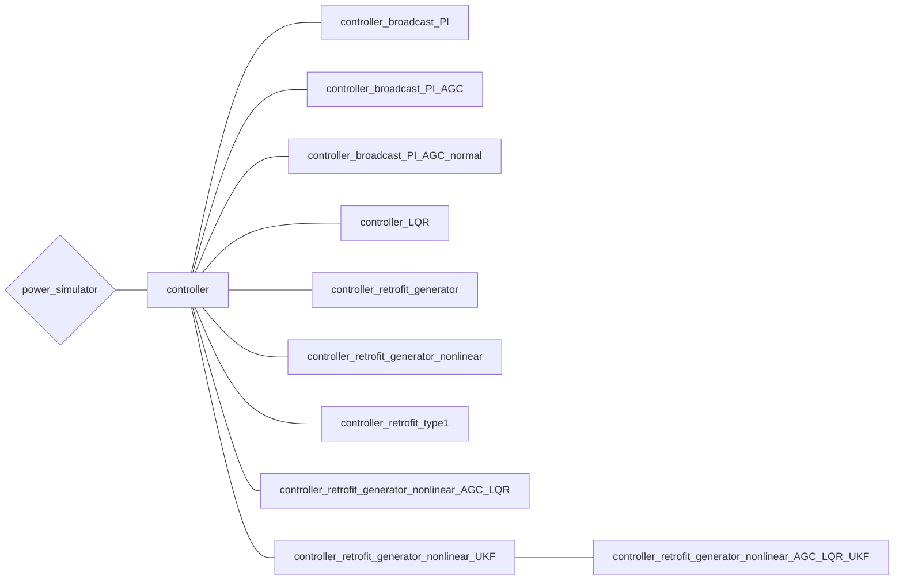

# （準備中）コントローラについて

## クラスの全体像(再掲)

まずはコントローラに関するクラスの全体像を示します。

## controller

[controller.m]()

全てのコントローラクラスの基底クラス．  

## controller_broadcast_PI

[controller_broadcast_PI.m]()

ブロードキャストコントローラ（PIコントローラ）の実装で，generatorへの入力をAGCポートに限定したもの（**controller**の派生クラス）  
**controller_broadcast_PI_AGC**（入力にAGCポートとAVRポートを持つ）に含まれるため削除予定．

## controller_broadcast_PI_AGC

[controller_broadcast_PI_AGC.m]()

ブロードキャストコントローラ（PIコントローラ）の実装（**controller**の派生クラス）  

## controller_broadcast_PI_AGC_normal

[controller_broadcast_PI_AGC_normal.m]()

ブロードキャストコントローラ（PIコントローラ）の実装（**controller**の派生クラス）  
[controller_broadcast_PI_AGC_normal](/Docs/controller/#controller_broadcast_pi_agc_normal)との違いは，ゲインを電力に比例した形にしていること（generatorの規模に比例して調整電力を分配する）

## controller_LQR

[controller_LQR.m]()

あるバスに対するLQRの実装（**controller**の派生クラス）  
rectifierの有無を比較するために使用した．

## controller_retrofit_generator

[controller_retrofit_generator.m]()

全てのレトロフィットコントローラクラスの基底クラス（**controller**の派生クラス）

## controller_retrofit_generator_nonlinear

[controller_retrofit_generator_nonlinear.m]()

レトロフィットコントローラの実装で，generatorの非線形性を考慮したもののうち，コントローラ設計を$H_\infty$設計で行うもの（**controller_retrofit_genarator**の派生クラス）

## controller_retofit_type1

[controller_retrofit_type1.m]()

レトロフィットコントローラの実装で，線形化されたネットワークを対象としたもの（**controller_retrofit_generator_nonlinear**の派生クラス）
相互接続信号は`w=x`, `v=V`

- `obj = controller_retrofit_type1(net, idx, ratio, sys_model, varargin)`  
    コンストラクタ
    - `net`: コントローラが付加されるネットワークのインスタンス．
    - `idx`: コントローラが付加されるバスの番号．複数のバスをまとめて局所システムとするときはベクトル形式で指定．
    - `ratio`:  入力へのペナルティ．  
        0だと入力制約なし，$\infty$で$K_{inter}＝0$になる（規定値: 0）
    - `sys_model`: 環境モデル．  
      状態空間モデル（ssクラス）が与えられるとそのモデルを用いる．  
      実数が与えられると，実環境をその次数で低次元化したモデルを用いる．  
      [ ]が与えられると，環境モデルを用いない（規定値: [ ]）

## controller_retrofit_generator_nonlinear_AGC_LQR

[controller_retrofit_generator_nonlinear_AGC_LQR]()

レトロフィットコントローラの実装で，generatorの非線形性を考慮したもののうち，コントローラ設計をLQRで行うもの（**controller_retrofit_genarator**の派生クラス）

## controller_retrofit_generator_nonlinear_UKF

[controller_retrofit_generator_nonlinear_UKF.m]()

レトロフィットコントローラの実装（**controller_retrofit_genarator**の派生クラス）

### controller_retrofit_generator_nonlinear_AGC_LQR_UKF

[controller_retrofit_generator_nonlinear_AGC_LQR_UKF.m]()

レトロフィットコントローラの実装（**controller_retrofit_genarator_nonlinear_UKF**の派生クラス）

