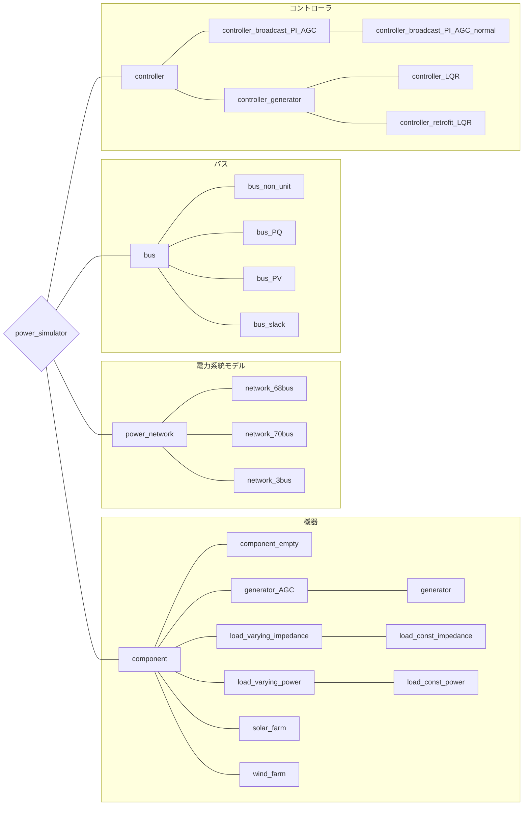

# 
ドキュメント一覧

既存のメソッドやクラスについての情報集

### :fontawesome-solid-arrow-circle-right: **[power_network](../power_network)**：電力系統モデルについて

### :fontawesome-solid-arrow-circle-right: **[bus](../power_network)**：バスについて

### :fontawesome-solid-arrow-circle-right: **[component](../component)**：コンポーネント（バスに接続する機器）について

### :fontawesome-solid-arrow-circle-right: **[controller](../controller)**：コントローラについて

 

---
### 
クラスの全体構成図

以下にpower_simulator上でのクラスの全体構成を示しておきます。チュートリアルを進めていく中や作業中に自身の使っている関数が何をするためのコマンドかわからなくなった際に目次代わりに利用してください。

