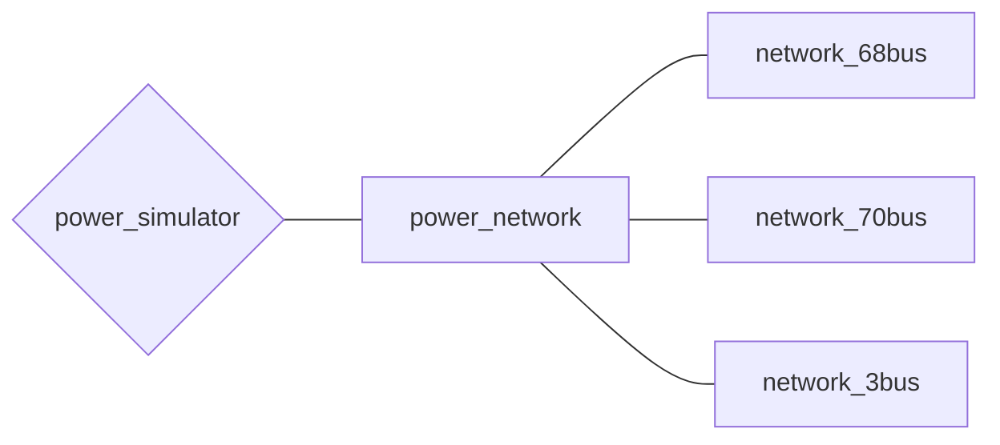

# 電力系統モデルについて

## 電力系統モデルについて取り扱っているチュートリアル
- [電力ネットワークの構成について](../../abstract)
- [「教科書に沿って学ぶ」ベース(withText)](../../Tutorials/withText)
- [解析する電力ネットワークを作成する(make_net)](../../Tutorials/make_net)
- [電力ネットワークの解析(analysis_net)](../../Tutorials/analysis_net)
- [【第一回】既存系統モデルのシミュレーション](../../Tutorials/step1)
- [シミュレーション結果のデータの読み方](../../Tutorials/step1-2)
- [【第二回】線形化したシステムを使う](../../Tutorials/step2)

## *power_network* クラスの全体像

まずは電力系統モデルに関するクラスの全体像を示します。

## **power_network**
([@power_network/power_network.m]()) 

全ての電力系統モデルの基底クラス．

### メンバ変数
- bus：バスのセル配列
- branch：ブランチのテーブル
- omega0(=2*pi*60)：  
    基準角周波数（デフォルトは60Hz）
- str_display(='none')：  
    非線形の方程式求解の際の表示レベル（デフォルトは出力を表示しない）
- display_simulate(=true)：  
    常微分方程式求解の進捗の表示有無（デフォルトは表示する）
- x_ss：状態の平衡点配列
- V_ss：電圧の平衡点配列
- I_ss：電流の平衡点配列
- controllers：コントローラのセル配列
- controllers_global：グローバルコントローラのセル配列
- tol：数値計算(ode)における許容誤差
- plotfunc(=@odephas2)：  
    数値計算(ode)における描画処理（[]を指定することで描画しないこともできる）
- reset_time(=5)：  
    数値計算(ode)のタイムアウト時間（デフォルトは5秒）
- retry(=true)  
    数値計算(ode)のタイムアウト時の処理（デフォルトはリトライ）

### メンバ関数
- **`out = simulate(obj, t, u, idx_u, options)`**  
    システムのシミュレーションを行い、その結果を出力する関数
    - 入力変数 `t`  
        シミュレーション時間の設定
    - 入力変数 `u`  
        バスへの入力
    - 入力変数 `idx_u`  
        入力するバスの指定  
    - 入力引数 `option`  
        シミュレーションのオプションを設定する（構造体）  
        - x_init：  
            状態の初期値（規定値: x_ss）  
            バスごとのセル配列あるいは，すべてをスタックしたベクトル．  
            out.Xを入れると，outの最後の状態からスタートする
        - V_init：  
            電圧の初期値（規定値: x_init に対応した値）  
            バスごとのセル配列あるいは，すべてをスタックしたベクトル．  
        - I_init：  
            電流の初期値（規定値: x_init に対応した値）  
            バスごとのセル配列あるいは，すべてをスタックしたベクトル．  
        - xk_init：  
            レトロフィットコントローラの状態の初期値（規定値: 0）  
            コントローラごとのセル配列，あるいは，すべてをスタックしたベクトル．  
            out.Xkを入れると，outの最後の状態からスタートする．
        - xkg_init：  
            グローバルコントローラの状態の初期値（規定値: 0）  
            コントローラごとのセル配列，あるいは，すべてをスタックしたベクトル．  
            out.Xk_globalを入れると，outの最後の状態からスタートする．
        - fault：  
            地絡の条件．  
            {[tstart, tend], idx_fault}というセル配列のセル配列．
        - linear：  
            線形化したシステムでシミュレーションを行うかどうか（規定値: false）
    - 出力引数 `out`  
        16の機器（generator）ごとの時間応答データが含まれる構造体  
        - t：時刻
        - X：バスの状態（バスごとのセル配列）
        - V：バスの電圧（バスごとのセル配列）
        - Xk：レトロフィットコントローラの状態（コントローラごとのセル配列）
        - Xk_global：グローバルコントローラの状態（コントローラごとのセル配列）
        - U：レトロフィットコントローラが生成した入力（コントローラごとのセル配列）
        - U_global：グローバルコントローラが生成した入力（コントローラごとのセル配列）
        - sol：ode15sが返す解sol
-  **`add_controller_global(obj, controller)`**  
    システムにグローバルコントローラを追加する関数
    - 入力引数 `controller`  
        controllerクラスのインスタンス  
        ただし、コントローラはグローバルコントローラに限る。
-  **`out = add_controller(obj, controller)`**  
    - システムにコントローラを追加する関数
    - 入力引数 `controller`  
        controllerクラスのインスタンス  
        ただし、追加するコントローラが指定するバスにすでにコントローラが追加されている場合は、削除してから追加する。
-  **`out = remove_controller_global(obj, idx)`**  
    システムのグローバルコントローラのうち、指定したバスに追加されているものを削除する関数
    - 入力引数 `idx`：削除するグローバルコントローラの追加されているバス
-  **`out = remove_controller(obj, idx)`**  
    システムのコントローラのうち、指定したバスに追加されているものを削除する関数
    - 入力引数 `idx`：削除するコントローラの追加されているバス
-  **`[sys] = get_sys(obj, with_controller)`**  
    システムの線形化を行い、状態空間モデルを取得するための関数  
    `@power_network/get_sys.m`に実装されている
    - 入力引数 `with_controller`  
        コントローラを含めたシステムの状態空間モデルを取得するか否か（規定値: false（含めない））
    - 出力引数 `sys`
        線形化したシステムの状態空間モデル  
        (モデルについての説明を追加する)

## **network_68bus**
([network_68bus.m]()) 

**IEEE 68bus 16machine システム**（[引用元](https://www.springer.com/gp/book/9780387259499)）の実装（ ***power_network*** クラスの派生クラス）  
発電機として[generatorAGC](../component/#generator_agc)を，負荷として[load_varying_impedance](../component/#load_varying_impedance) を導入したネットワークである．  

## **network_70bus**
([network_68bus.m]()) 

[**Dynamic Modeling, Stability, and Control of Power Systems With Distributed Energy Resources: Handling Faults Using Two Control Methods in Tandem**](https://ieeexplore.ieee.org/document/8667520) における，IEEE 68bus 16machineシステムへ solar, wind farm を1つづつ導入した電力ネットワークの実装（ ***power_network*** クラスの派生クラス）  
発電機として[generator](../component/#generator)を，負荷として[load_const_impedance](../component/#load_const_impedance), [load_const_power](../component/#load_const_power) を導入したネットワークである．  
ここで，ネットワーク定義の際に `net=network_70bus(load_type)`のように定義するが，load_typeには1~2を代入する．負荷には，1の場合は[load_const_impedance](../component/#load_const_impedance)，2の場合は[load_const_power](../component/#load_const_power)を導入する．引数が省略されている場合は[load_const_impedance](../component/#load_const_impedance)を負荷として導入する．  

(ひとまず削除)  

## **network_3bus**
([network_3bus.m]()) 

(追加予定)