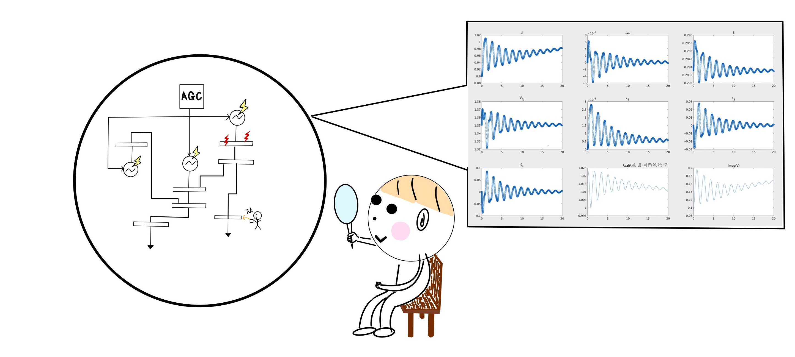

# <div style="text-align: center;"><span style="font-size: 130%; color: black;">電力ネットワークの解析</span></div>

***
前の章では電力ネットワークを定義し、その情報を変数`net`に格納する所までできたと思います。
本章では、その変数`net`をクラス内でメソッドとして定義されている関数を用いて、シュミレーションしていきます。  
  
<br>
<span style="font-size: 125%; color: black;">__本章を始めるにあたって用意するもの：`電力ネットワークの情報を格納した変数net`__</span>  
  
<br>
まだ変数`net`を定義していなくて、取り敢えず解析をしてみたいという方は「電力ネットワークの作成編」の【既存のモデルを使う】の章で書かれているインスタンスを用いる方法が良いかと思います。詳しくは[doc](../../Docs/docs)のページも参考にしてください。  

```matlab
%サンプルコード
net = network_9bus;  %9busモデルの情報をnetに格納する
net = network_68bus; %68busモデルの情報をnetに格納する
net = network_70bus; %70busモデルの情報をnetに格納する

```

## <span style="font-size: 100%; color: black;">【定義した電力モデルのシュミレーション】</span>

:material-arrow-right-drop-circle: [シュミレーションの実行方法とオプションの設定方法。](../step1)  

:material-arrow-right-drop-circle: [シュミレーションの結果データの構造と見方。](../step1-2)  

## <span style="font-size: 100%; color: black;">【定義した電力モデルの線形化】</span>
:material-arrow-right-drop-circle: [対象の電力システムを数理モデルとして線形化し状態空間表現を得る。](../step2)  

:material-arrow-right-drop-circle: [線形化したシステムのシュミレーションを実行する。](../step2-2)  

<br><br><br>

[電力ネットワークの構成編のページへ](../../abstract){ .md-button .left }
[電力ネットワークの作成編のページへ](../make_net){ : .md-button .right }