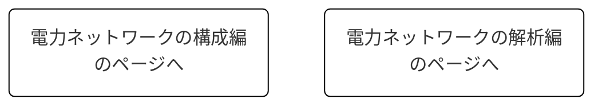

# <div style="text-align: center;"><span style="font-size: 120%; color: black;">解析する電力ネットワークを作成する</span></div>

***
power_simulatorでは電力ネットワークの情報をクラスを用いて一つの変数に格納し定義します。(本サイトの解説では`net`という変数名を用いています。)この変数の内部には、

- バスの情報を含む`bus`  
- ブランチの情報を含む`branch`
- コントローラの情報を含む`controller,controller_global`
- 潮流計算によって求まった各バスのパラメータの定常値`x_ss,V_ss,I_ss`
- その他にクラス内の関数を実行するために必要なパラメータ

などがあり、さらに変数`bus`の中には各バスにおける定常状態でのパラメータやそのバスに付加されている機器の情報を含む変数`component`などがあります。図で表すと以下の様な感じに電力ネットワークの情報が格納されています。  
<div style="text-align: center;">

</div>

<span style="font-size: 130%; color: black;">__本章ではこの変数`net`を定義することが目標となります。__</span>  
  

## <span style="font-size: 100%; color: black;">【既存のモデルを使う方法】</span>

本シュミレータには、既存の電力システムを定義するための関数が既に３つあり、以下のように実行することで定義できます。  

```matlab
net = network_9bus;  %9busモデルの情報をnetに格納する場合
net = network_68bus; %68busモデルの情報をnetに格納する場合
net = network_70bus; %70busモデルの情報をnetに格納する場合
```

新しく設計した電力システムを定義する場合は、バスやブランチ、発電機、制御器などの接続関係やパラメータをそれぞれ代入していくことで定義していくことになり、実際に

- <u> __<span style="font-size: 90%; color: black;">参考書の流れに沿って進めていくタイプのTutorial</span>__</u> [[Link]](./Tutorial_withText)  
- <u>__<span style="font-size: 90%; color: black;">下の</span><span style="font-size: 90%; color: blue;">[基礎編]</span><span style="font-size: 90%; color: black;">の「パラメータを自分で設定してみよう」という章</span>__</u> [[Link]](./step4.md)  

などの解説では、そのような工程を行っています。  
上記の`network_○○bus`という関数は、電力システムを定義する関数と一緒に予め既存の電力システムのパラメータを定義しておくことで、関数を実行するだけでパラメータをもとに電力システムを自動で定義してくれるようにしたものになります。  
  

</br>

**それでは以下に新しい電力システムの定義やコントローラの付加をし、変数`net`を定義していく方法を難易度別に解説していきます。。**

## <span style="font-size: 100%; color: blue;">【基礎編】</span>
- [<span style="font-size: 120%; color: blue;"><u>既存のコントローラをネットワークに付加しよう</u>。</span>](./step3.md)  
- [<span style="font-size: 120%; color: blue;"><u>既存のバスやコンポーネントのパラメータを自分で設定してみよう</u>。</span>](./step4.md)  

## <span style="font-size: 100%; color: red;">【応用編】</span>
- [<span style="font-size: 120%; color: red;"><u>新しい機器を自作しよう</u>。</span>](./step5.md)  
- [<span style="font-size: 120%; color: red;"><u>新しい制御器を自作しよう</u>。</span>](./step6.md)  

---
<div style="text-align: center;">

</div>