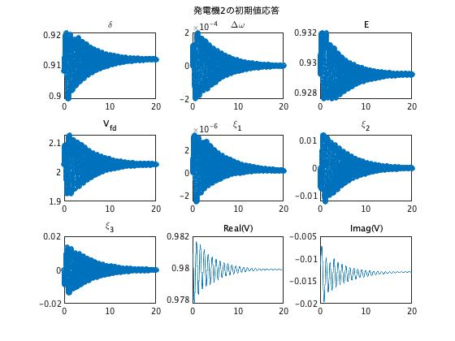

# シュミレーション結果のデータの読み方

## simulate関数の出力変数の読み方

前のステップでsimulate関数を用いて対象の電力システムのシュミレーションを行い、その結果を変数`out`に格納しました。  
  
本ステップでは、この出力変数`out`からのデータの読み方を解説していきます。  
この変数`out`は構造体となっており、内部にいくつかの変数を格納しています。この中でシュミレーションした結果の各発電機の状態を調べるために着目すべき変数は`t , X , V , I`です。
  
#### ・変数 `t`  

シュミレーション結果は設定した時間区間の中で何点かサンプリングする時間を決めその時点での各バスの状態や電圧・電流の値を求めます。そのサンプリングする時間を表としてまとめたものが変数`t`に格納されています。  
  
#### ・変数 `X, V, I`  

それぞれ各バスの状態、電圧、電流の値が時系列に並んで格納されています。  
データの読み方は変数`X`の場合を例にとって、以下の図に示しました。変数`V`,`I`についても同様です。
なお、下の表は以下の様にコマンドを打って表示することもできます。  
```matlab
out.X{1}
```

<div style="text-align: center;"></div>  

以上のことをまとめると各データを  
「out.t」「out.X{1}・・・out.X{16}」「out.V{1}・・・out.V{68}」「out.I{1}・・・out.I{68}」  
と並べると縦が時間軸、横が各バスのデータを表す表のようになる関係ということなります。

<div style="text-align: center;"></div>

### データのグラフ表示
これらのデータの並び方をもとに出力データをグラフとして出力する方法を示します。  
以下のコードを最後に付け加えると，発電機ごとの内部状態の応答を3×3=9つのグラフで見ることができます。．
```
num_generator = nnz(~cellfun(@isempty,out.X));
names = {'\delta', '\Delta\omega', 'E', 'V_{fd}', '\xi_1', '\xi_2', '\xi_3'};
for i = 1:num_generator
    figure
    for j = 1:7
        subplot(3, 3, j), plot(out.t, out.X{i}(:, j), 'o'), title(names{j}, 'Interpreter', 'tex');
    end
    subplot(3, 3, 8), plot(out.t, out.V{i}(:, 1)), title('Real(V)');
    subplot(3, 3, 9), plot(out.t, out.V{i}(:, 2)), title('Imag(V)');
    sgtitle([num2str(i),'番目のバスのデータ']);
end
```

### コード例
例としてシュミレーションを行い結果をグラフ化するコードと、その出力結果のうち１番目のバスと２番めのバスのグラフを載せておきます。
```matlab
% ネットワークの定義
net = network_68bus();

% シミュレーションのためのオプションを定義・決定
option = struct();
option.x_init = net.x_ss; % 初期状態を平衡点に設定
option.x_init(1) = option.x_init(1) + 0.1; % バス1の初期状態を平衡点から少しずらす

% シミュレーションの実行
out = net.simulate([0 20], option);  % 0~20s

num_generator = nnz(~cellfun(@isempty,out.X));
names = {'\delta', '\Delta\omega', 'E', 'V_{fd}', '\xi_1', '\xi_2', '\xi_3'};
for i = 1:num_generator
    figure
    for j = 1:7
        subplot(3, 3, j), plot(out.t, out.X{i}(:, j), 'o'), title(names{j}, 'Interpreter', 'tex');
    end
    subplot(3, 3, 8), plot(out.t, out.V{i}(:, 1)), title('Real(V)');
    subplot(3, 3, 9), plot(out.t, out.V{i}(:, 2)), title('Imag(V)');
    sgtitle([num2str(i),'番目のバスのデータ']);
end
```
 

## 結果から考察できること

以上の仮定でシュミレーション結果の読み方グラフ化の仕方まで解説しました。最後に、この出力結果から考察できることの例をあげておこうと思います。  


### ・<u>Δωは０に収束しているか？</u>
系統周波数は関東では50Hz,関西では60Hzと定められている。このΔωつまり周波数偏差はその系統周波数との差を表しており、Δω＝0のときが発電の周波数が系統周波数に一致している状態を指している。もちろん、発電機の周波数が系統周波数と一致することが望ましく、Δωが０に収束するかどうかということは電力システムを評価する上で重要な指標になる。


### ・<u>δ、Eの収束値</u>
テキストの第５章の内容でも触れられていましたが、ある電力ネットワークについてシュミレーションした際の各時刻における回転子偏角`δ`と内部電圧`E`のの値は、平衡点の安定領域を見積もる際の考察には重要な情報となったりします。各時刻(t番目のサンプル時刻)におけるi番目のバス状態の値は
```matlab
out.X{i}(t,:)
```
などで見ることができます。

### ・<u>収束にかかる時間</u>
地絡がおきたときにどれくらいの時間で周波数偏差を定常値に収束させられるかは電力系統の安定性にもつながってきます。
<span style="color: red">ここにコントローラを付加したシステムと付加してないシステムで収束度が異なるというような例となる出力結果を貼り付けたい。</span>


### ・<u>ξ1~ξ3は０に収束している？</u>
PSSの状態変数`ξ1,ξ2,ξ3`が０に収束しているかどうか。
<span style="color:red">これが何を指すのかは調べる必要あり、、、</span>