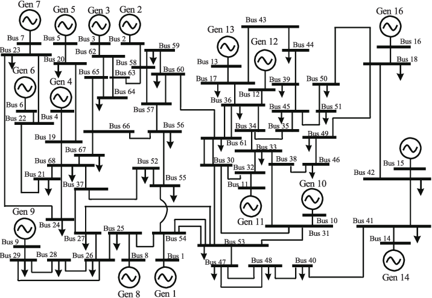
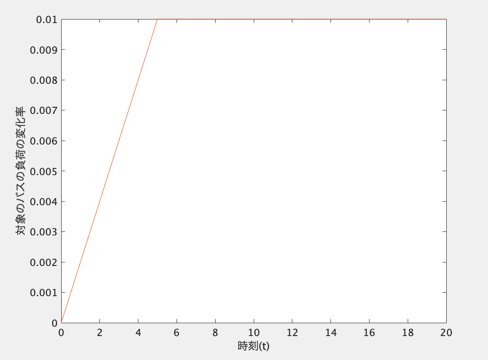
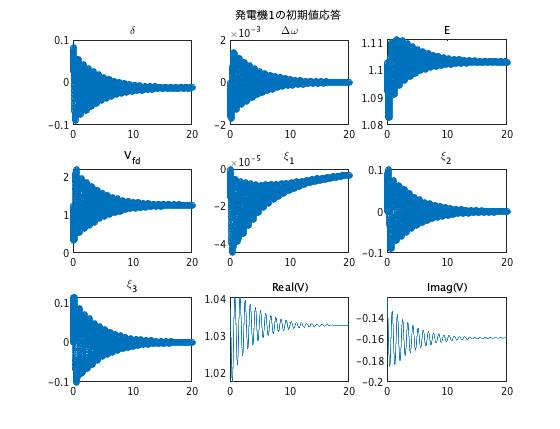
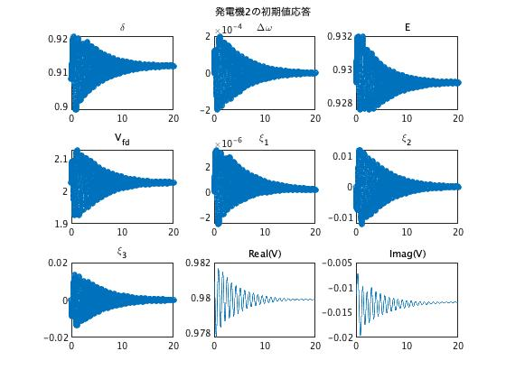
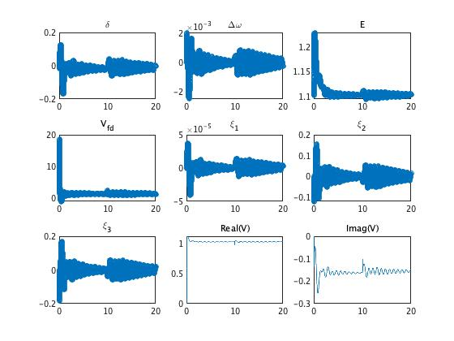
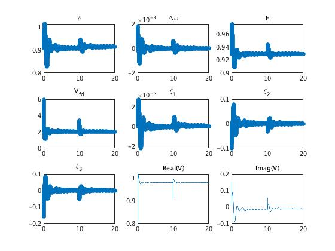

# 【第一回】既存系統モデルのシミュレーション

- 本ステップでできるようになること  
    既存の系統モデルの応答をシミュレーションすることで，システムの挙動や特性についてシミュレーションベースで知ることができるようになる

本ステップでは既存の系統モデル，特に下図に示すような IEEE 68bus system の初期値応答・外乱応答・入力応答をシミュレーションします  
初めに，**既存のネットワークの定義**と**シミュレーションの実行**について記法と変数について解説します  
次に例として，

- 初期値応答  
    バス1の回転子偏角の初期状態を少しずらした時の各発電機の応答
- 外乱応答  
    0秒でバス1に，10秒でバス10に地絡を発生させた時の各発電機の応答
- 入力応答  
    バス1, 10にランダムな入力を加えた時の応答

のような状況を例示します  
最後に，**応答結果の図示**について解説し，応答結果を示します
<br><br><br>
<div style="text-align: center;">
<a href="../../Figures/IEEE68bus.png" target="_blank"></a>
</div>


## 解説

### シミュレーションの実行

シミュレーションの実行は次のように行う．
```
out = net.simulate(t, u, idx_u, option);
```

- (クラス)インスタンス`net`  
    *power_network*クラスのインスタンスを使用する．
- 入力変数 `t`  
    シミュレーション時間（例えば `t=[0 20]` で0~20秒に設定できる）
- 入力変数 `u`  
    バスへの入力
- 入力変数 `idx_u`  
    入力を印加するバスの番号
- 入力引数 `option`  
    シミュレーションのオプション  
    - x_init：  
        状態の初期値（規定値: x_ss）  
        バスごとのセル配列あるいは，すべてをスタックしたベクトル．  
        行列（時系列データを想定）で指定すると，最終行の各列の値が抽出される．
    - fault：  
        地絡の条件．  
        {[tstart, tend], idx_fault}というセル配列のセル配列．
- 出力引数 `out`  
    16の機器（generator）ごとの時間応答データが含まれる  
    - t：時刻
    - X：バスの状態（バスごとのセル配列）
    - V：バスの電圧（バスごとのセル配列）

## 例1：初期値応答

まず初めに初期値応答の仕方を説明します。  
初期値は`option.x_init`に値を入れることで設定できます。この変数に値を入れない場合は、自動的に初期値を潮流計算から求まった平衡点にしてシュミレーションが行われます。以下にそのサンプルコードを紹介します。  
バス1の初期状態のみを平衡点から少しずらした時の応答．
```
% ネットワークの定義
net = network_68bus();

% シミュレーションのためのオプションを定義・決定
option = struct();
option.x_init = net.x_ss; % 初期状態を平衡点に設定
option.x_init(1) = option.x_init(1) + 0.1; % バス1の初期状態を平衡点から少しずらす

% シミュレーションの実行
out = net.simulate([0 20], option);  % 0~20s
```


## 例2：外乱応答

次に外乱応答の実行方法を紹介します。以下がそのサンプルコードです。  
0~0.07秒にバス1，10~10.05秒にバス10の地絡を外乱として印加した時の応答．
```
% ネットワークの定義
net = network_68bus();

% シミュレーションのためのオプションを定義・決定
option = struct();
option.fault = {{[0 0.07], 1}, {[10 10.05], 10}}; % 地絡の設定

% シミュレーションの実行
out = net.simulate([0 20], option); % 0~20s
```

## 例3：入力応答

関数`net.simulate()`には各バスに入力を入れてシュミレ−ションすることができます。入力の種類としては大きく分けて2種類あります。

- 1つめは発電機バスへの入力です。
- 2つめは負荷バスへの入力です。

 本チュートリアルでは68busのネットワークを例として使っているため、例えば入力先をbus1~bus16にすれば発電機バスへの入力ということになり、逆に負荷バスに入力を入れる場合は入力先のバスを負荷バスにします。  

まず、発電機に入力を入れる場合の例を示します。下の例ではバス１とバス10に入力を入れているので発電機バスへの入力ということになります。  
発電機バスへの入力は各バスに２つずつあり、それぞれAGCポートとPSSポートに対応しています。AGCポートは機械的トルクP_mech、PSSポートは界磁電圧V_fieldの値を入力するポートになります。
```
net = network_68bus();% ネットワークの定義
N = 1000; % データ数
Ts = 0.01; % サンプリング周期
t = (0:N-1)*Ts;
u = randn(N, 4); % 今回は2つのバスに入力するので2x2=4つの入力をランダムに決定
bus_u = [1, 10]; % 入力するバスの指定

% シミュレーションの実行
out = net.simulate(t, u, bus_u); % 入力を0次ホールド
```
  
次に、負荷バスへ入力を入れる場合の例を示します。下の例では負荷バスであるbus18に入力を入れています。  
まず前提として、負荷バスに入力を入れられるのは、指定した負荷バスのコンポーネントが`load_varying_impedance`の場合のみです。各バスのコンポーネントの指定の仕方は[ネットワークの定義編](../make_net)を参照してください。  
負荷バスへの入力も各バスごとに２つずつあり、対応するバスのアドミタンスの実部と虚部のそれぞれの変化率を指定します。例えばバス18に[0.01,0.02]と入力を入れると、バス18の負荷の値はもともとの値に比べ実部が(1+0.01)倍、虚部が(1+0.02)倍に変化させることができます。
```
net = network_68bus;% ネットワークの定義

t = [0:0.1:5, 20];
u = [0:0.01/50:0.01, 0.01; ...
     0:0.01/50:0.01, 0.01]';
out = net.simulate(t, u, 18);
```
このコードではバス18の負荷を以下のグラフのような変化率で変化させたときのシュミレーションを行っていることになります。  

<div style="text-align: center;">
<a href="../../Figures/tutorial1-1-3.jpg"  target="_brank"></a>
</div>

## 例4：初期値・外乱・入出力応答（組み合わせ）

ここまでの設定を全て組み合わせて以下のような場合のシュミレーションを実行させます。「バス1の初期状態のみを平衡点から少しずらし，0~0.07秒にバス1，10~10.05秒にバス10の地絡を外乱として印加する状況で，バス1,10にランダムの入力を加えた時の応答」
```
% ネットワークの定義
net = network_68bus();

% シミュレーションのためのオプションを定義・決定
option = struct();
option.x_init = net.x_ss; % 初期状態を平衡点に設定
option.x_init(1) = option.x_init(1) + 0.1; % バス1の初期状態を平衡点から少しずらす
option.fault = {{[0 0.07], 1}, {[10 10.05], 10}}; % 地絡の設定
N = 1000; % データ数
Ts = 0.01; % サンプリング周期
t = (0:N-1)*Ts; % シミュレーション時間の決定
u = randn(N, 4); % 今回は2つのバスに入力するので2x2=4つの入力をランダムに決定
bus_u = [1, 10]; % 入力するバスの指定

% シミュレーションの実行
out = net.simulate(t, u, bus_u, option);
```


## シミュレーション結果を見る

以下のコードを最後に付け加えると，発電機ごとの内部状態の応答を3×3=9つのグラフで見ることができます．
```
names = {'\delta', '\Delta\omega', 'E', 'V_{fd}', '\xi_1', '\xi_2', '\xi_3'};
for i = 1:16
	figure
	for j = 1:7
		subplot(3, 3, j), plot(out.t, out.X{i}(:, j), 'o'), title(names{j}, 'Interpreter', 'tex');
	end
	subplot(3, 3, 8), plot(out.t, out.V{i}(:, 1)), title('Real(V)');
	subplot(3, 3, 9), plot(out.t, out.V{i}(:, 2)), title('Imag(V)');
end
```
## シミュレーション結果の例
- 例1の結果として，発電機1と2の内部状態の初期値応答のグラフ

<div style="text-align: center;">
<a href="../../Figures/tutorial1-1-1.jpg" target="_blank"></a>
<a href="../../Figures/tutorial1-1-2.jpg" target="_blank"></a>
</div>


- 例2の結果として，発電機1と2の内部状態の外乱応答のグラフ

<div style="text-align: center;">
<a href="../../Figures/tutorial1-2-1.jpg" target="_blank"></a>
<a href="../../Figures/tutorial1-2-2.jpg" target="_blank"></a>
</div>