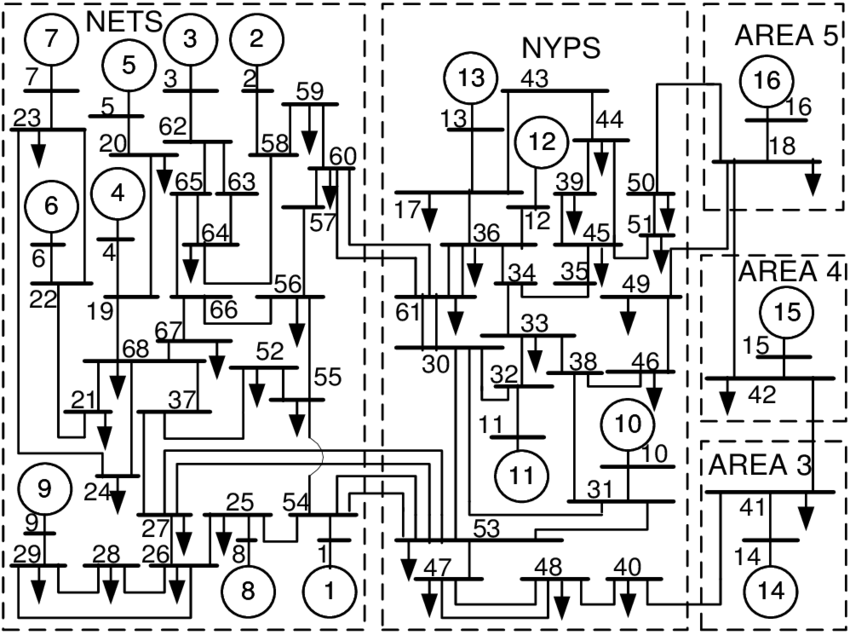

# Step1（既存系統モデルのシミュレーション）

- 本ステップでできるようになること  
    既存の系統モデルの応答をシミュレーションすることで，システムの挙動や特性についてシミュレーションベースで知ることができるようになる

本ステップでは既存の系統モデル，特に下図に示すような IEEE 68bus system の初期値応答・外乱応答・入力応答をシミュレーションします  
初めに，**既存のネットワークの定義**と**シミュレーションの実行**について記法と変数について解説します  
次に例として，

- 初期値応答  
    バス1の回転子偏角の初期状態を少しずらした時の各発電機の応答
- 外乱応答  
    0秒でバス1に，10秒でバス10に地絡を発生させた時の各発電機の応答
- 入力応答  
    バス1, 10にランダムな入力を加えた時の応答

のような状況を例示します  
最後に，**応答結果の図示**について解説し，応答結果を示します
<br><br><br>



## 解説
### ネットワークの定義

ネットワークの定義は次のように行う．
```
net = network_68bus();
```
- 出力変数`net`  
    ネットワーク内部の情報としてbus, branch, generator, controllerなどの情報が含まれる

power_simulator では電力系統モデルがすでにいくつか定義されている．  
詳細は [Power Network](/Docs/power_network/) を参照のこと．  
本チュートリアルでは [network_network_68bus](/Docs/power_network/#network_68bus) を使用する．  
[network_network_68bus](/Docs/power_network/#network_68bus) はIEEE 68bus 16machine システムの実装で，発電機として[generator_AGC](/Docs/component/#generator_agc)を，負荷として[load_varying_impedance](/Docs/component/#load_varying_impedance)を導入したネットワークである．  


### シミュレーションの実行

シミュレーションの実行は次のように行う．
```
out = net.simulate(t, u, idx_u, option);
```
- 入力変数 `t`  
    シミュレーション時間を設定（例えば `t=[0 20]` で0~20秒に設定できる）
- 入力変数 `u`  
    バスへの入力
- 入力変数 `idx_u`  
    入力するバスの指定
- 入力引数 `option`  
    シミュレーションのオプションを設定する  
    - x_init：  
        状態の初期値（規定値: x_ss）  
        バスごとのセル配列あるいは，すべてをスタックしたベクトル．  
        out.Xを入れると，outの最後の状態からスタートする
    - fault：  
        地絡の条件．  
        {[tstart, tend], idx_fault}というセル配列のセル配列．
- 出力引数 `out`  
    16の機器（generator）ごとの時間応答データが含まれる  
    - t：時刻
    - X：バスの状態（バスごとのセル配列）
    - V：バスの電圧（バスごとのセル配列）
    - Xk：レトロフィットコントローラの状態（コントローラごとのセル配列）
    - Xk_global：グローバルコントローラの状態（コントローラごとのセル配列）
    - U：レトロフィットコントローラが生成した入力（コントローラごとのセル配列）
    - U_global：グローバルコントローラが生成した入力（コントローラごとのセル配列）
    - signals：コントローラが定義した信号を格納した構造体（コントローラごとのセル配列）
    - sol：ode15sが返す解sol


## 例1：初期値応答

バス1の初期状態のみを平衡点から少しずらした時の応答．
```
% ネットワークの定義
net = network_68bus();

% シミュレーションのためのオプションを定義・決定
option = struct();
option.x_init = net.x_ss; % 初期状態を平衡点に設定
option.x_init(1) = option.x_init(1) + 0.1; % バス1の初期状態を平衡点から少しずらす

% シミュレーションの実行
out = net.simulate([0 20], option);  % 0~20s
```


## 例2：外乱応答

0~0.07秒にバス1，10~10.05秒にバス10の地絡を外乱として印加した時の応答．
```
% ネットワークの定義
net = network_68bus();

% シミュレーションのためのオプションを定義・決定
option = struct();
option.fault = {{[0 0.07], 1}, {[10 10.05], 10}}; % 地絡の設定

% シミュレーションの実行
out = net.simulate([0 20], option); % 0~20s
```

## 例3：入力応答

バス1,10にランダムの入力を加えた時の応答．
```
% ネットワークの定義
net = network_68bus();

N = 1000; % データ数
Ts = 0.01; % サンプリング周期
t = (0:N-1)*Ts;
u = randn(N, 4); % 今回は2つのバスに入力するので2x2=4つの入力をランダムに決定
bus_u = [1, 10]; % 入力するバスの指定

% シミュレーションの実行
out = net.simulate(t, u, bus_u); % 入力を0次ホールド
out_foh = net.simulate_foh(t, u, bus_u); % 入力を1次ホールド
```

## 例4：初期値・外乱・入出力応答（組み合わせ）

バス1の初期状態のみを平衡点から少しずらし，0~0.07秒にバス1，10~10.05秒にバス10の地絡を外乱として印加する状況で，バス1,10にランダムの入力を加えた時の応答．
```
% ネットワークの定義
net = network_68bus();

% シミュレーションのためのオプションを定義・決定
option = struct();
option.x_init = net.x_ss; % 初期状態を平衡点に設定
option.x_init(1) = option.x_init(1) + 0.1; % バス1の初期状態を平衡点から少しずらす
option.fault = {{[0 0.07], 1}, {[10 10.05], 10}}; % 地絡の設定
N = 1000; % データ数
Ts = 0.01; % サンプリング周期
t = (0:N-1)*Ts; % シミュレーション時間の決定
u = randn(N, 4); % 今回は2つのバスに入力するので2x2=4つの入力をランダムに決定
bus_u = [1, 10]; % 入力するバスの指定

% シミュレーションの実行
out = net.simulate(t, u, bus_u, option);
```


## シミュレーション結果を見る

以下のコードを最後に付け加えると，発電機ごとの内部状態の応答を3×3=9つのグラフで見ることができる．
```
names = {'\delta', '\Delta\omega', 'E', 'V_{fd}', '\xi_1', '\xi_2', '\xi_3'};
for i = 1:16
	figure
	for j = 1:7
		subplot(3, 3, j), plot(out.t, out.X{i}(:, j), 'o'), title(names{j}, 'Interpreter', 'tex');
	end
	subplot(3, 3, 8), plot(out.t, out.V{i}(:, 1)), title('Real(V)');
	subplot(3, 3, 9), plot(out.t, out.V{i}(:, 2)), title('Imag(V)');
end
```
## シミュレーション結果の例
- 例1の結果として，発電機1と2の内部状態の初期値応答のグラフ  
 

- 例2の結果として，発電機1と2の内部状態の外乱応答のグラフ  
 