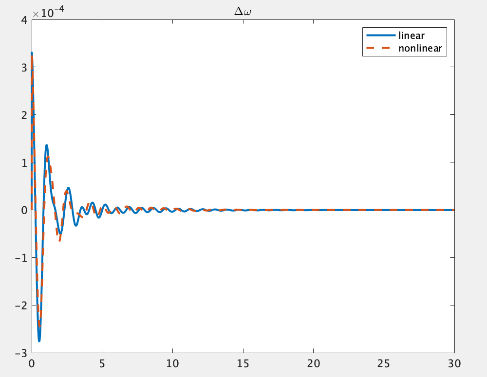

# 【第二回】線形化したシステムを使う

- 本ステップでできるようになること
    - 線形化したシステムの状態空間表現を取得できるようになる
    - 線形化したシステムについてシミュレーションすることができるようになる

## 解説
### ネットワークの定義
まず、システムの線形化をしていくにあたり線形化するシステムを定義する.  
ここでは9busの電力システムを例として以下のように定義する.
```
net = network_9bus();
```

- 出力変数`net`  
    ネットワーク内部の情報としてbus, branch, generator, controllerなどの情報が含まれる
<br>

### __線形化したシステムのシュミレーションの実行__
線形化したシステムのシュミレーションは以下のように行う.
```
option=struct();
option.linear=true;
out = net.simulate([0 20], option)
```
`option.linear`が`true`の場合はシステムを線形化してシミュレーションを行い、`faulse`の場合は線形化を行わずにシュミレーションを行う.  
それ以外の変数の設定や実行については、[STEP1](../step1)に示されている`net.simulate(t,option)`と同様であるため，そちらを参照されたい.
<br>

### __線形化したシステムの状態空間表現を得る__
####　関数`get_sys`の解説  
この関数は対象の電力システムを以下の式の様な状態空間表現に線形化するための関数である.  
$$
    \begin{matrix}
  　\dot{x}=A(x-x^*)+Bu\\
    　y=C(x-x^*)+Du\\
    \end{matrix}
    $$  
なお上の式で表される状態・入力・出力の定義は以下のようである.  

- 状態$x$  
         発電機の状態パラメータ7つずつの変数をさす．  
         あるi番目の発電機の状態を$x_i$とすると、
    $$
      x_i =\left(
        %\begin{align}
        \begin{array}{ccccccc}
        \delta_i %&= 回転子偏角
        \\
        \Delta\omega_i %&= 周波数偏差
        \\
        E_i %&= 内部電圧
        \\
        V_{fdi} %&= AGCの状態変数
        \\
        \xi_{1i} %&= PSSの状態変数１
        \\
        \xi_{2i} %&= PSSの状態変数２
        \\
        \xi_{3i} %&= PSSの状態変数３
        \\
        \end{array}
        %\end{align}
        \right)
    $$  
        と表され、上から順に  
      - 回転子偏角$\delta$  
      - 周波数偏差$\Delta\omega$  
      - 発電機の内部電圧$E$  
      - AGCの状態変数$V_{fd}$(1つ)  
      - PSSの状態変数$\xi$(3つ)  
    を指している.この状態$x_i$を用いて、発電機が全部で$I_G$個あるとき、
    $$
    x=\left(
        \begin{array}{}
        x_1\\
        \vdots\\
        x_{I_G}\\
        \end{array}
    \right)
    $$
    としたものが上の式で状態$x$として定義されている。  
- 入力$u$  
        PQバス・PVバス・slackバスへの入力(AGCポート，AVRポート)と、PQバスへの入力(外乱ポート)の変数をさす.  
        いま対象の電力システムのバスのうちnon-unitバスを除いたPQ・PV・slackバスの個数の合計を$I_{GL}$、PQバスの個数を$I_G$とすると、
    $$
    u=\left(
        \begin{array}{}
        u_1\\
        \vdots\\
        u_{I_{GL}}\\
        \\d_1\\
        \vdots\\
        d_{I_G}\\
        \end{array}
    \right)\cdots(★)
    $$
    が入力$u$として定義されている.  
    - __u__ について  
    i番目のバスにAGCポート、AVRポートが接続されている場合は  
    $$
    u_i=\left(
        \begin{array}{}
        u_{1i}\\
        u_{2i}\\
        \end{array}
    \right)
    $$
    と２つの変数を持つが、例えばAGCが接続されていないバスｊがあった場合$u_j$については$u_j=(u_2)$のみとなる。  
    - __d__ について  
    各発電機バスには３つの外乱ポートがあり  
    $$
    d_i=\left(
        \begin{array}{}
        d_{1i}\\
        d_{2i}\\
        d_{3i}\\
        \end{array}
    \right)
    $$
    と表され、(★)式の各ｄは３つずつ変数を持つ.  

- __出力$y$__  
        出力変数$y$の各行は以下の変数をさしている。  
        各発電機の状態変数 ($x$)： 各７要素$\leftarrow$状態$x$の場合の７つの変数と同じ  
        発電機の評価関数 ($z$) : 各１要素  
        各バスでの電圧の値($V_{real},V_{image}$) : 各2要素(実部と虚部の情報)  
        各バスでの電流の値($I_{real},I_{image}$) : 各2要素(実部と虚部の情報)  
        対象の電力システムのバスのうち全バスの個数を$I_{all}$、PQバスの個数を$I_G$とすると、
    $$
    y=\left(
        \begin{array}{}
        x_1\\
        \vdots\\
        x_{I_G}\\
        \\z_1\\
        \vdots\\
        z_{I_G}\\
        \\V_1\\
        \vdots\\
        V_{I_{all}}\\
        \\I_1\\
        \vdots\\
        I_{I_{all}}\\
        \end{array}
    \right)
    $$
    という構成になっている。なお各$V_i$と$I_i$はフェーザ表示で表されるため、
    $$
    V_i=\left(
        \begin{array}{}
        V_{real}\\
        V_{image}\\
        \end{array}
    \right)
    \quad,\quad
    I_i=\left(
        \begin{array}{}
        I_{real}\\
        I_{image}\\
        \end{array}
    \right)
    $$と２変数ずつ格納されている.


#### 関数get_sysの実行
```
sys =  net.get_sys(with_controller);
```
get_sysで得られるシステムは平衡点からの偏差を状態ととっていることに注意．

- **入力引数**`with_controller`  
    with_controllerの値が`true`の場合はコントローラが付加されたシステム，`false`の場合はコントローラなしのシステムを返す．規定値は`false`.
      - `true`にする場合コントローラーの設定をしておく必要がある．コントローラの定義についての詳細は[STEP3](../step3)を参照．


- **出力変数**`sys`  
  出力された変数sysの中には以下のような変数が格納されている。  

  <div style="text-align: center;">
  <a href="../../Figures/tutorial2-getsys-1.jpg" target="_blank"></a>
  </div>  
  これらの変数の中には`get_sys`のスクリプト内で使用されている関数[ss(A,B,C,D)](https://jp.mathworks.com/help/control/ref/ss.html)によって自動的に生成される変数も含まれており、このうち実質的に情報を持っているのは以下に示す6つの変数のみである.  

-  __状態方程式の係数行列__`A,B,C,D`  
        線形化したシステムのA行列,B行列,C行列,D行列の各要素の情報を格納している.
- __入力情報__`InputGroup`  
            状態空間方程式の入力値$u$の各チャネルがどのバスの何の値に対応しているか示す．  
- __出力情報__`OutputGroup`  
            状態空間方程式の出力値$y$の各チャネルがどのバスの何の値に対応しているか示す.  

##　例１：コントローラーを追加する
```
sys =  net.get_sys(true);
```
この関数を実行するにはnetクラスの中にすでにコントローラーの情報が格納されている必要がある.  
power_networkのインスタンスを用いている場合、そのクラスの内部にはすでにブロードキャストのコントローラーなどが定義されている。それに加えてレトロフィットコントローラーなどを追加して定義しておくと、それらのコントローラを含めたシステムの状態空間方程式を導出させることができる。コントローラの設定については[STEP3](../step3)を参照.  
なお、`get_sys(false)`とするとコントローラーを除いたシステムの状態空間方程式を導出するということになる.


## 例２：特定の入力から出力までのシステムを見る
返数のsysに格納されているA行列B行列C行列D行列はバスの個数によっても大きさが変動し、本チュートリアルで扱っている電力システムも68個のバスによるシステムであり、その状態方程式は膨大な要素数を持つ行列方程式である.
ここでは、そのシステムの中から特定の入力から特定の出力までの一部分だけのシステムを抽出する方法を示す.
例えば入力`d1`から出力`z1`までのシステムを見たい場合，以下のように実行することで見ることができる.
```
sys('z1','d1')
```


## 例３：線形化したシステムのシミュレーション結果を見る

以下のコードは68busシステムを線形化し，その出力をグラフで表示するものです。ここでは2種類のサンプルコードを紹介します。  
  

まず1つ目のコードは、地絡応答についての応答を線形化を行ってシュミレーションしたプロットに、`get_sys`を用いて得られた状態空間モデルをもとに、`initial()`関数を用いて時間応答を求めたものを重ねたものです。下の結果を見ると2つの時間応答が一致していることがわかります。なお`initial()`は[Control System Toolbox]に標準搭載されている関数です。
```
net= network_68bus();
option_fault = struct();
option_fault.fault = {{[0, 0.01], 1}};
option_fault.linear = true;
out_fault = net.simulate([0, 0.01], option_fault);
option = struct();
option.x_init = out_fault.X;
opition.linear =true
out_linear = net.simulate([0 100], option);
sys = net.get_sys();
x0 = horzcat(out_fault.X{:});
x0 = x0(end, :)' - net.x_ss;
[z, t, x] = initial(sys, x0);
x = x+net.x_ss';
for i = 1:16
	figure
	p = plot(out_linear.t, out_linear.X{i}(:, 2), '-',out_nonlinear.t, out_nonlinear.X{i}(:, 2), '--');
    p(1).LineWidth = 2;
    p(2).LineWidth = 2; 
    title('\Delta\omega', 'Interpreter', 'tex');
    legend('linear','nonlinear')
end
```
  


  
2つめコードは１つめと同様に地絡応答についてのシュミレーションですが、ここでは同じネットワークシステム、同じ地絡条件のもとで線形化シュミレーションと非線形のままのシュミレーションの結果を比較するコードとなっています。出力結果は下のとおりです。
```
net = network_68bus();
option = struct();
option.fault = {{[0,0.01], 1}};
option.linear = false;
out_nonlinear = net.simulate([0, 30], option);
option.linear = true;
out_linear = net.simulate([0, 30], option);
for i = 1:16
	figure
	p = plot(out_linear.t, out_linear.X{i}(:, 2), '-',out_nonlinear.t, out_nonlinear.X{i}(:, 2), '--');
    p(1).LineWidth = 2;
    p(2).LineWidth = 2;
    title('\Delta\omega', 'Interpreter', 'tex');
    legend('linear','nonlinear')
end
```
  

