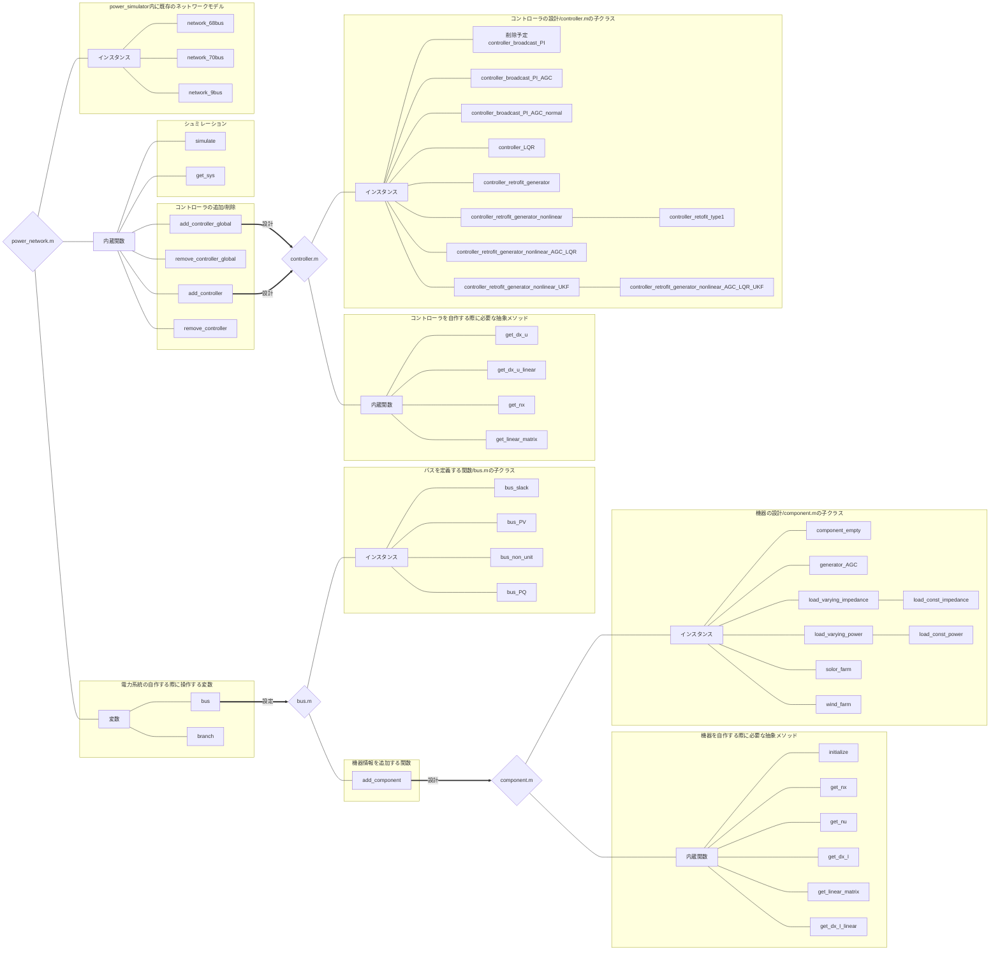

# Tutorials

## **power_simulatorの構成**
チュートリアルに進む前にここでpower_simulatorの全体構成を示しておきます。チュートリアルを進めていく中や作業中に自身の使っている関数が何をするためのコマンドかわからなくなった際に目次代わりに利用してください。

***

初めて利用する方向けのチュートリアル  
メソッドやクラスなどの詳しい説明は [Docs](../Docs/docs.md)へ

## [Step1（既存の系統モデルのシミュレーション）](./step1.md)

- 対象者：制御工学についての知識はあるが，電力系統については知識がない技術者
- できるようになること：
    - 既存の電力系統モデルに対して，初期値応答・外乱応答・入力応答などのシミュレーションを実行する

## [Step2（線形化したシステムを使う）](./step2.md)

- 対象者：制御工学の技術者
- できるようになること：
    - 線形化したシステムでのシミュレーションを行う
    - 線形化したシステムの状態空間表現を取得する

## [Step3（制御器の導入）](./step3.md)

- 対象者：レトロフィット制御の論文を読み，実際にシミュレーションを行いたい技術者
- できるようになること：
    - システムに既存のコントローラを付加してシミュレーションを行う
    - 既存のコントローラを付加されたシステムの状態空間表現を取得する

## [Step4（電力系統の自作）](./step4.md)

- 対象者：シミュレーション用の電力系統を自作したい技術者
- できるようになること：
    - 電力系統の自作
        - バスの定義
        - ブランチの定義
        - 機器の定義

## [Step5（機器の自作）](./step5.md)

- 対象者：既存の種類以外の機器を使用したい技術者
- できるようになること：
    - 機器の自作

## [Step6（制御器の自作）](./step6.md)

- 対象者：既存の種類以外の制御器を使いたい技術者
- できるようになること：
    - 制御器の自作

## おまけ

- レトロフィット制御器の自作
- 電力系統のシステム同定
