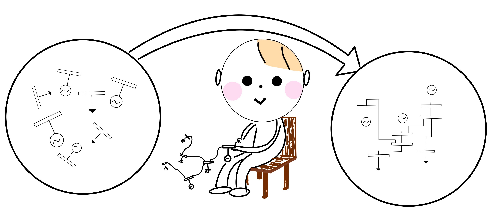
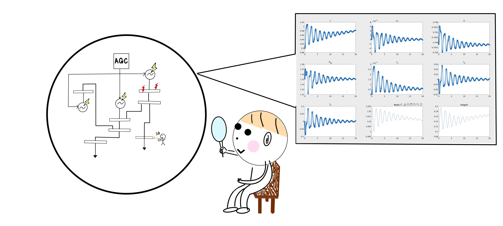

### power_simulatorを使うためのステップ
power_simulatorで解析するには大きく分けて２つのステップがあります。

以下に各ステップごとに説明していきます。

取り敢えず解析をしてみたいという方は、「解析編」から読み進めていただいて大丈夫です。  
既にいくつかの電力システム(9bus,68bus,70busシステム)を定義するための一連のコードを記述したmファイルを用意してあり、そちらを利用する方法は「解析編」でも示しています。

【電力システムを作成/定義する click↓】

【作成した電力システムを解析する click↓】

