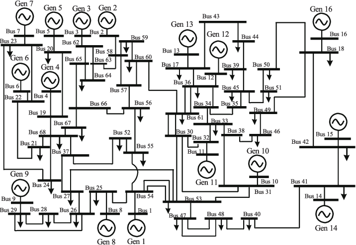

# 
電力ネットワークの構成について

### 
【電力システムとはどのようなもの？】

まずはじめに、電力システムとはどういったものなのか？ということを、電力システムでシュミレーションをする際に使用される代表的なモデルを例にして解説していきます。  
下の図は電力ネットワークの代表的なモデルである「IEEE68busモデル」と呼ばれるものです。  
このモデルは以下のものによって構成されています。

- 68個のバス(図中のBus)
- 16個の発電機(図中のGen)
- 35個の負荷(図中の▼)
- そして各バスどうしをつなぐブランチ(各バス間の線ー)  

IEEE68busモデル

 

---
以下では、電力システムの各構成要素について説明していきます。

### 
【バスとは？】

バスとは発電機や負荷と送電網の中継点の様なものです。  
電力の需給バランスを計算する潮流計算では、このバスに送られてくる(逆に送り出される)有効電力Pと無効電力Q、さらに各バスでの電圧の大きさ|V|、位相∠Vを考えることで所望の需給バランスを実現させるパラメータを導出しています。

  

### 
【ブランチとは？】

バス間の送電線のことです。現実の世界では電線などがこのブランチにあたります。

  

### 
【コンポーネントという概念は？】

コンポーネントとはその名の通り「機器」のことです。  
具体的には「発電機」や「負荷」などのバスに付加するものたちの総称のことです。  

* コンポーネントの枠に発電機が付加されたものを**発電機バス**と呼びます。  
    発電機バスは一般的にPVバスに分類されますが、電力ネットワーク内の発電機バスのうち1つだけslackバスという特別なバスが存在します。  
* コンポーネントの枠に負荷が付加されたものを**負荷バス**と呼びます。  
    負荷バスはPQバスに分類されます。  
* またコンポーネントの枠に何も付加されていないバスも存在し、**non-unitバス**と呼びます。  
     このバスは負荷バスの負荷の値が無限大としたときと同じとみなせ、このバスもPQバスに分類されます。  

実際にpower_simuratorでは`componentクラス`が定義されており、その子クラスに負荷や発電機のクラスが定義されています。

  

### 
【PVバス、PQバス、slackバスって？？】

バスに付いての説明の際にも触れましたが、潮流計算では各バスに送られてくる(逆に送り出される)有効電力Pと無効電力Qと、各バスの電圧の大きさ|V|,位相∠Vの計4つのパラメータ、n個のバスで構成された電力ネットワークならば、計４n個のパラメータを考えます。当然この中のいくつかのパラメータを指定しないと、他のパラメータは一意に定まりません。そのため各バスの4つのパラメータのうちいくつかのパラメータを指定します。  
この指定するパラメータが

- 有効電力Pと無効電力Qのバスを`PQバス`
- 有効電力Pと電圧の大きさ|V|のバスを`PVバス`
- 電圧の大きさ|V|と電圧の位相∠Vのバスを`slackバス`

といいます。  
  
潮流計算では一般に各バスの電圧の位相差は求まりますが、各バスの位相は一意に定まりません。そのため電力ネットワークに電圧の位相角を指定するslackバスというバスを置くことで、各バスの電圧の位相を一意に定められるようにしているのです。逆にslackバスを複数定義してしまうと、今度は全ての指定したパラメータを満たす解がないということが起きえてしまいます。そのためslackバスは全バスで１つだけになっているのです。

   

[電力ネットワークの作成編のページへ](../Tutorials/make_net){ .md-button .left }
[電力ネットワークの解析編のページへ](../Tutorials/analysis_net){ : .md-button .right }