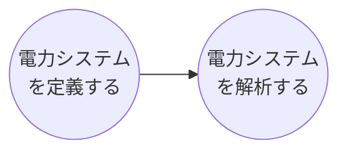

# 電力系統に対するレトロフィット制御シミュレータ

本サイトはpower_simulator の公式ドキュメントです.  
### power_simulatorとは？
power_simulatorは、各人で電力系統システムの設計・解析するために作られたMATLAB言語のツールです。  
具体的には、解析したい電力ネットワークを定義し、その初期応答や外乱応答、線形化システムの導出などの解析を行うことで、落雷などによって地絡が起きた際の状態やコントローラを新しく設計し導入した時の安定・不安定を解析するなど様々な状況を想定した解析を補助します。  
power_simulatorを制作する背景に使われている数理モデル等は「**参考書：電力システム制御理論**」の内容に即しており、こちらで紹介された理論をもとに構築されたものとなっております。理論に基づいてシュミレーションを進めて行きたい方は参考書の内容にそれぞれ対応付けながら進めていただくと分かりやすいかと思います。テキストに即したTutorialは[[こちら](←久木くんが作ってくれたファイル)]()  
  
### power_simulatorを使うためのステップ
power_simulatorで解析するには大きく分けて２つのステップがあります。

以下に各ステップごとに説明していきます。
  

【電力システムって何で構成されてるの？ click↓】

  

【電力システムを作成/定義する click↓】

  

【作成した電力システムを解析する click↓】

## Contents

- [Tutorials](./Tutorials/tutorials.md)  
    初めて利用する方向けのチュートリアル
- [Docs](./Docs/docs.md)  
    既存のメソッドやクラスについての情報集

## Require

- Optimization Toolbox
- Control System Toolbox
- Robust Control Toolbox