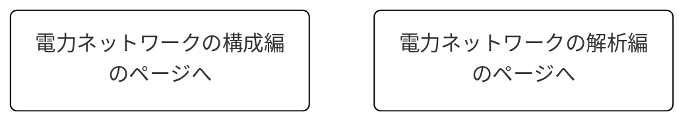

# 
解析する電力ネットワークを作成する

***
power_simulatorでは電力ネットワークの情報をクラスを用いて一つの変数に格納し定義します。(本サイトでは`net`という変数としています。)この変数の内部には、

- バスの情報を含む`bus`  
- ブランチの情報を含む`branch`
- コントローラの情報を含む`controller,controller_global`
- 潮流計算によって求まった各バスのパラメータの定常値`x_ss,V_ss,I_ss`
- その他にクラス内の関数を実行するために必要なパラメータ

などがあり、さらに変数`bus`の中には各バスにおける定常状態でのパラメータやそのバスに付加されている機器の情報を含む変数`component`などがあります。図で表すと以下の様な感じに電力ネットワークの情報が格納されています。  

__本章ではこの変数`net`を定義することが目標となります。__  
  
それでは以下に、この変数`net`を定義する方法を難易度別に解説していきます。

## 【既存のモデルを使う】
- networkクラスのインスタンスを呼び出そう。

## 【基礎編】
- 既存のバスやコンポーネントのパラメータを自分で設定してみよう。  
  ↑主にSTEP4の内容を貼り付ける
- 既存のコントローラをネットワークに付加しよう。  
  ↑主にSTEP3の内容を貼り付ける

## 【応用編】
- 新しい機器を自作しよう。  
  ↑主にSTEP5の内容を貼り付ける
- 新しい制御器を自作しよう。  
  ↑主にSTEP6の内容を貼り付ける

---

